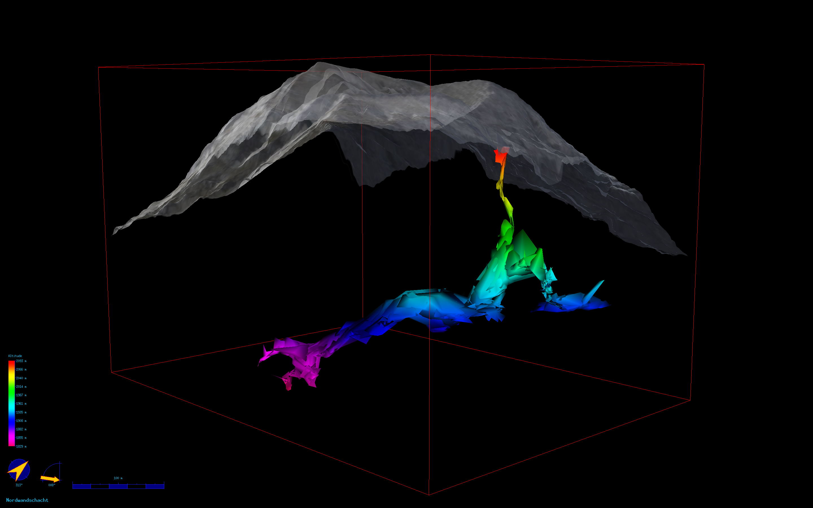

# plankermira
A repository of the therion code for Nordwandschacht cave files

## A Loch 3d model of the cave and overlying terrain

Below is a first view of the survey data in relation with the overlying terrain. The deepest part of the cave (purple) is the southwestern end of the chamber. 
Terrain is derived from free airborne lidar terrain models provided by the Austrian government and the province of Styria ([more information here](https://www.landesentwicklung.steiermark.at/cms/beitrag/12803182/142970647/))

